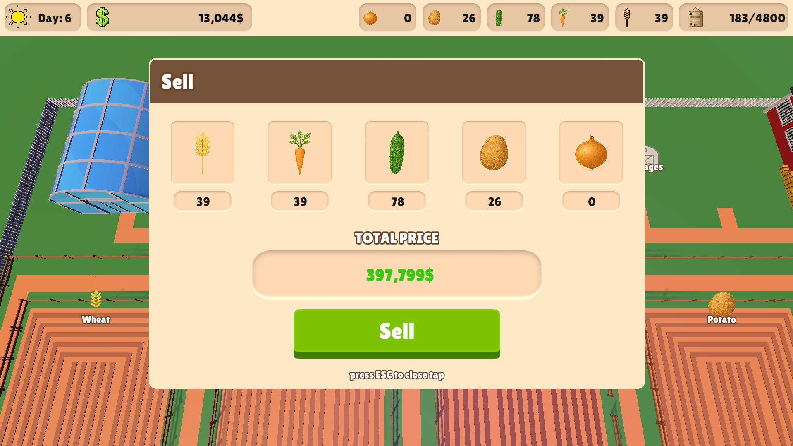
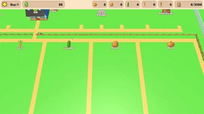
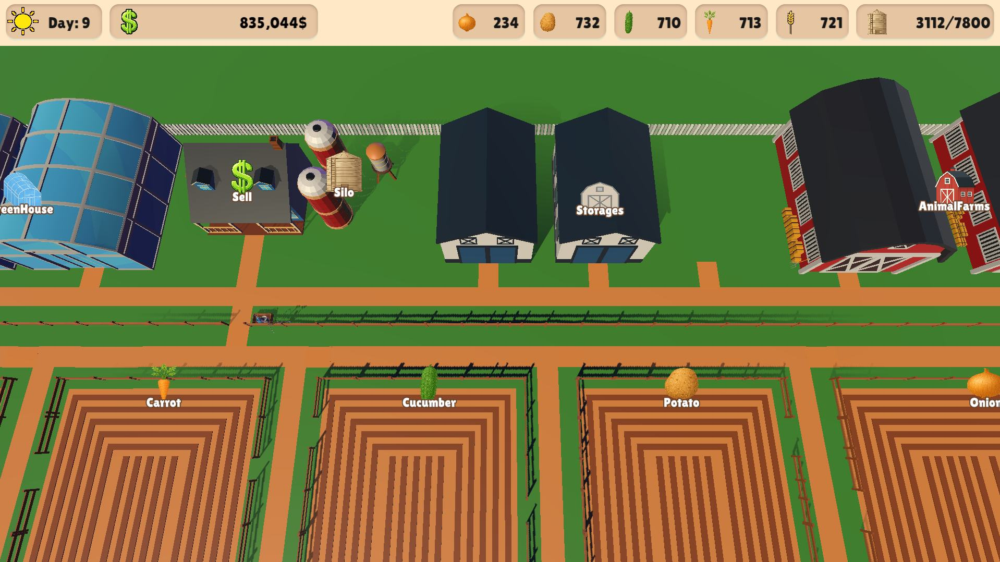
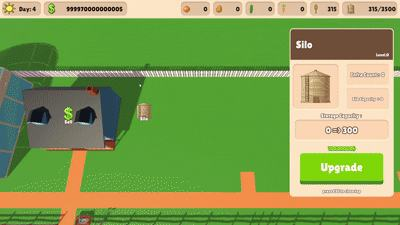

<div align="center">

# 🌱 Grow Game

### 농작물을 키우고, 판매하고, 인프라를 확장하는 3D 방치형 농장 경영 게임

<p>
  
  
  
</p>

밀, 당근, 오이, 감자, 양파를 생산해 수익을 만들고<br>
농장과 각종 인프라를 업그레이드하며 더 큰 농장으로 성장시켜 보세요.

</div>

---

## 🎬 게임 플레이 영상

<div align="center">
  <a href="https://www.youtube.com/watch?v=GrsxAK6qNEE">
    
  </a>
  <br>
  <sub>이미지를 클릭하면 YouTube에서 게임 플레이 영상을 볼 수 있습니다.</sub>
</div>

---

## 📸 게임 화면

### 작물 판매

수확한 작물의 보유량과 총 판매 금액을 확인하고 한 번에 판매할 수 있습니다.

<p align="center">
  
</p>

### 농장 전경

게임 초반의 농장에서 시작해 작물 밭과 생산 시설을 하나씩 확장합니다.

<table>
  <tr>
    <td width="50%" align="center"></td>
    <td width="50%" align="center"></td>
  </tr>
  <tr>
    <td align="center"><sub>게임 초반</sub></td>
    <td align="center"><sub>인프라가 확장된 농장</sub></td>
  </tr>
</table>

### 인프라 정보 및 업그레이드

농장이나 시설을 클릭하면 카메라가 해당 위치로 이동하며 현재 레벨, 효과, 다음 업그레이드 수치를 보여 줍니다.

<p align="center">
  
</p>

---

## 🎮 게임 플레이 & 특징

- **5종 작물 자동 생산**: 밀, 당근, 오이, 감자, 양파가 농장 레벨에 따라 자동으로 생산됩니다.
- **생산과 판매의 성장 루프**: 모은 작물을 판매해 자금을 확보하고, 다시 농장과 시설에 투자합니다.
- **농장별 성장**: 각 작물 농장은 최대 3레벨까지 강화할 수 있으며 생산량이 단계적으로 증가합니다.
- **물 주기 시스템**: 저수지를 건설한 뒤 농장에 물을 공급해 작물 생산 효율을 높일 수 있습니다.
- **시설 확장**: 시설을 업그레이드하면 실제 건물 수와 외형이 바뀌어 농장이 점점 발전합니다.
- **직관적인 정보 UI**: 시설을 클릭해 현재 효과와 다음 업그레이드 수치를 바로 비교할 수 있습니다.
- **부드러운 카메라 이동**: 드래그로 농장을 둘러보고, 시설 선택 시 해당 위치를 자연스럽게 확대합니다.

### 주요 인프라

| 인프라 | 역할 |
| --- | --- |
| **Silo** | 보관 가능한 전체 작물 용량을 늘립니다. |
| **Storage** | 추가 저장 공간을 확보합니다. |
| **Green House** | 모든 작물의 생산량을 증가시킵니다. |
| **Animal Farm** | 작물 판매 수익에 보너스를 더합니다. |
| **Village** | 단계별로 판매 수익을 증가시키고 마을을 확장합니다. |
| **Reservoir** | 농장에 물을 공급할 수 있는 기반 시설입니다. |

### 조작 방법

| 조작 | 기능 |
| --- | --- |
| `W` `A` `S` `D` | 농장 화면 이동 |
| 마우스 드래그 | 카메라 이동 |
| 시설/농장 클릭 | 정보 확인 및 업그레이드 화면 열기 |
| `ESC` | 열린 정보 또는 판매 창 닫기 |

---

## 🛠 Tech Stack

- **Engine**: Unity 2022.3.28f1 (LTS)
- **Language**: C#
- **Rendering**: Universal Render Pipeline 14.0.11
- **UI**: Unity UI (uGUI), TextMeshPro
- **Architecture**: MonoBehaviour 기반 컴포넌트 설계, 역할별 Manager 분리
- **Tools**: Git, GitHub, Unity Recorder

---

## 📂 주요 소스 코드 및 프로젝트 구조

핵심 게임 로직은 `GrowGame/Assets/Script` 경로에 역할별로 분리되어 있습니다.

```text
GrowGame/
├─ Assets/
│  ├─ Scenes/                 # 메인 게임 씬
│  └─ Script/
│     ├─ Infras/
│     │  ├─ FarmManager.cs    # 작물별 자동 생산 및 보관량 관리
│     │  ├─ FarmUpgrade.cs    # 농장 레벨과 외형 변화 관리
│     │  ├─ InfraManager.cs   # 인프라 효과, 비용, 업그레이드 처리
│     │  ├─ InfraClick.cs     # 시설 선택, 카메라 이동, 정보 UI 처리
│     │  └─ InfraInfo.cs      # 시설별 표시 데이터
│     ├─ MoneyManager.cs      # 작물 가격 계산 및 판매 처리
│     ├─ UIManager.cs         # HUD와 판매 UI 갱신
│     ├─ CameraController.cs  # 마우스 드래그 카메라 이동
│     ├─ PlayerViewMove.cs    # 키보드 화면 이동
│     ├─ BGMManager.cs        # 배경음악 관리
│     └─ ButtonSoundManager.cs# UI 및 건설 효과음 관리
├─ Packages/
└─ ProjectSettings/
```

---

## 🚀 실행 방법

1. 저장소를 클론합니다.

   ```bash
   git clone https://github.com/wkdrudgnsdla/GrowGame.git
   ```

2. Unity Hub에서 저장소 안의 `GrowGame` 폴더를 엽니다.
3. Unity `2022.3.28f1` 버전으로 프로젝트를 실행합니다.
4. `Assets/Scenes/SampleScene.unity` 씬을 열고 Play 버튼을 누릅니다.

---

<div align="center">
  <sub>Grow your crops, expand your farm, and build your own farming empire.</sub>
</div>
